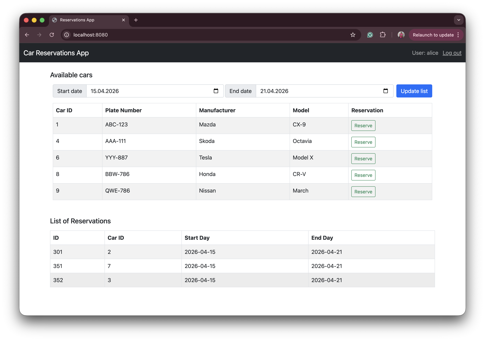

# Car Rental Application

Web application for Car Rental agency. Built as distributed app
with several microservices. The main aim of this app is to learn Quarkus Java Framework
to build modern cloud native applications with Java.

------

 ## Technologies used
- Quarkus
- Java 25
- Keycloak
- PostgreSQL
- MongoDB
- gRPC
- GraphQL
- REST

### Users Service UI
